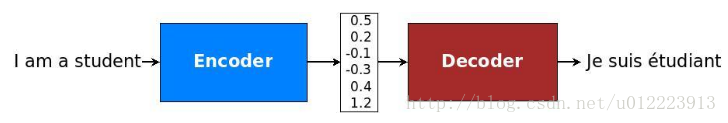
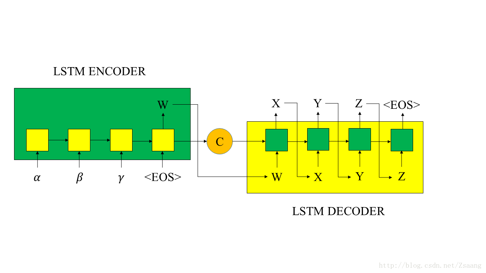
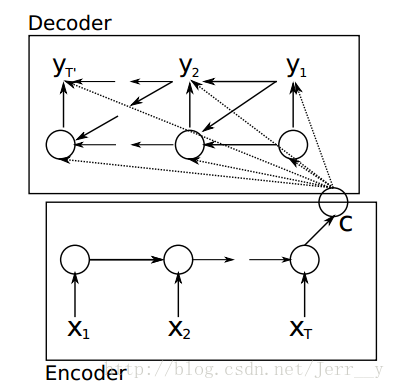
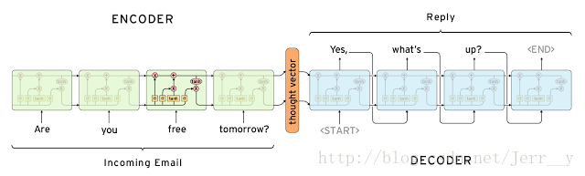
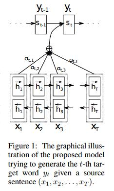

## Encoder-Decoder结构

### 1.经典的Encoder-Decoder结构

**图2：Encoder-Decoder示意图**

+ Encoder意思是将输入序列转化成一个固定长度的向量

+ Decoder意思是将输入的固定长度向量解码成输出序列

+ 其中编码解码的方式可以是RNN,CNN等

+ 在机器翻译：输入（hello） -> 输出 （你好）。输入是1个英文单词，输出为2个汉字。 
在对话机器中：我们提（输入）一个问题，机器会自动生成（输出）回答。这里的输入和输出显然是长度没有确定的序列（sequences）。

+ 要知道，在以往的很多模型中，我们一般都说输入特征矩阵，每个样本对应矩阵中的某一行。就是说，无论是第一个样本还是最后一个样本，他们都有一样的特征维度。但是对于翻译这种例子，难道我们要让每一句话都有一样的字数吗，那样的话估计五言律诗和七言绝句又能大火一把了，哈哈。但是这不科学呀，所以就有了 seq2seq 这种结构。

**图3：经典的Encoder-Decoder示意图**

上图中，C是encoder输出的最终状态，向量C通常为RNN中的最后一个隐节点（h，Hidden state），或是多个隐节点的加权总和，作为decoder的初始状态；W是encoder的最终输出，作为decoder的初始输入。

**图4：经典的Encoder-Decoder示意图(LSTM or CNN）**

上图为seq2seq的encode和decode结构，采用CNN/LSTM模型。在RNN中，当前时间的隐藏状态是由上一时间的状态和当前时间的输入x共同决定的，即

+ 【编码阶段】

得到各个隐藏层的输出然后汇总，生成语义向量

也可以将最后的一层隐藏层的输出作为语义向量C

+ 【解码阶段】

这个阶段，我们要根据给定的语义向量C和输出序列y1,y2,…yt1来预测下一个输出的单词yt，即

也可以写做

其中g()代表的是非线性激活函数。在RNN中可写成yt=g(yt1,ht,C)，其中h为隐藏层的输出。

### 2.Paper中的结构解析

+ --->[Cho et al., 2014 . Learning Phrase Representations using RNN Encoder-Decoder for Statistical Machine Translation.](https://arxiv.org/abs/1406.1078) 

**图5：论文[1] 模型按时间展开的结构**

算是比较早提出Encoder-Decoder这种结构的，其中 Encoder 部分应该是非常容易理解的，就是一个RNNCell（RNN ，GRU，LSTM 等） 结构。每个 timestep， 我们向 Encoder 中输入一个字/词（一般是表示这个字/词的一个实数向量），直到我们输入这个句子的最后一个字/词 XT ，然后输出整个句子的语义向量 c（一般情况下， c=hXT , XT 是最后一个输入）。因为 RNN 的特点就是把前面每一步的输入信息都考虑进来了，所以理论上这个 c 就能够把整个句子的信息都包含了，我们可以把 c 当成这个句子的一个语义表示，也就是一个句向量。在 Decoder 中，我们根据 Encoder 得到的句向量 c， 一步一步地把蕴含在其中的信息分析出来。

论文[1]中的公式表示如下：

ht=f(ht-1,yt−1,c) 

同样，根据 ht 我们就能够求出 yt 的条件概率：

P(yt|yt−1,yt−2,...,y1,c)=g(ht,yt−1,c)

+ 这里有两个函数 f 和 g , 一般来说， f 函数结构应该是一个 RNNCell 结构或者类似的结构（论文[1]原文中用的是 GRU）；
+ g 函数一般是 softmax （或者是论文 [4] 中提出的 sampled_softmax 函数）。
+ 我们可以先这样来理解：在 Encoder 中我们得到了一个涵盖了整个句子信息的实数向量 c ，现在我们一步一步的从 c 中抽取信息。
+ 首先给 Decoder 输入一个启动信号 y0(如特殊符号<START>), 然后Decoder 根据 h0,y0，c ，就能够计算出 y1 的概率分布了
+ 同理，根据 h1,y1，c 可以计算y2 的概率分布…以此类推直到预测到结束的特殊标志 <END>，才结束预测。

论文[1]Cho et al. 中除了提出 Encoder-Decoder 这样一个伟大的结构以外，还有一个非常大的贡献就是首次提出了 Gated Recurrent Unit （GRU）这个使用频率非常高的RNN结构。

注意到在论文[1]Cho et al. 的模型结构中（如 图1 所示），中间语义 c 不仅仅只作用于 decoder 的第 1 个时刻 ，而是每个时刻都有 c 输入。所以，在这篇论文中， Decoder 预测第 t 个 timestep 的输出时可以表示为： 

p(yt)=f(ht,yt−1,c)

而在下面的论文[2] 中，Decoder 预测第 t 个 timestep 的输出时可以表示为： 

p(yt)=f(ht,yt−1)

 
+ --->[Sutskever et al., 2014. Sequence to Sequence Learning with Neural Networks.](https://arxiv.org/abs/1409.3215)

**图6:论文[2] 模型结构**

+ 在论文[2] 中，Encoder 最后输出的中间语义只作用于 Decoder 的第一个时刻，这样子模型理解起来其实要比论文[1] 更容易一些。 
+  Encoder-Decoder 其实是最简单的

+ 论文[2] seq2seq 模型结构（原文为 4 层 LSTM，这里展示的是 1 层 LSTM）
+ 图中的 Encoder 和 Decoder 都只展示了一层的普通的 LSTMCell。从上面的结构中，我们可以看到，整个模型结构还是非常简单的。 EncoderCell 最后一个时刻的状态 [cXT,hXT] 就是上面说的中间语义向量 c ，它将作为 DecoderCell 的初始状态。然后在 DecoderCell 中，每个时刻的输出将会作为下一个时刻的输入。以此类推，直到 DecoderCell 某个时刻预测输出特殊符号 <END> 结束。
+ 论文 [2]Sutskever et al. 也是我们在看 seq2seq 资料是最经常提到的一篇文章， 在原论文中，上面的Encoder 和 Decoder 都是 4 层的 LSTM，但是原理其实和 1 层 LSTM 是一样的。原文有个小技巧思想在上面的邮件对话模型结构没展示出来，就是原文是应用在机器翻译中的，作者将源句子顺序颠倒后再输入 Encoder 中，比如源句子为“A B C”，那么输入 Encoder 的顺序为 “C B A”，经过这样的处理后，取得了很大的提升，而且这样的处理使得模型能够很好地处理长句子。此外，Google 那篇介绍机器对话的文章（论文[5] ）用的就是这个 seq2seq 模型。

+ --->[Bahdanau et al., 2014. Neural Machine Translation by Jointly Learning to Align and Translate.](https://arxiv.org/abs/1409.0473) 

**图7：论文[3] 模型结构**

+ 注意机制（Attention Mechanism）,作为Seq2Seq中的重要组成部分，注意机制最早由Bahdanau等人于2014年提出，该机制存在的目的是为了解决RNN中只支持固定长度输入的瓶颈。在该机制环境下，Seq2Seq中的编码器被替换为一个双向循环网络（bidirectional RNN）。 

+ 在Decoder进行预测的时候，Encoder 中每个时刻的隐藏状态都被利用上了,这样子，Encoder 就能利用多个语义信息（隐藏状态）来表达整个句子的信息了。
+ Encoder用的是双向GRU，这个结构其实非常直观，在这种 seq2seq 中效果也要比单向的 GRU 要好。

+ ---->[Jean et. al., 2014. On Using Very Large Target Vocabulary for Neural Machine Translation.](https://arxiv.org/abs/1412.2007)

+ 论文[4]介绍了机器翻译在训练时经常用到的一个方法（小技巧）sample_softmax ，主要解决词表数量太大的问题。
+ sampling softmax解决了softmax分母部分计算量大的问题，在词向量中用的较多。
+ 不是本节重点详见[6]。

+ --->[Vinyals et. al., 2015. A Neural Conversational Model. Computer Science.](https://arxiv.org/pdf/1506.05869v1.pdf)

介绍了Google机器对话，用的模型就是[论文2]中的模型。

### 3.参考文献

[1] <https://www.jianshu.com/p/124b777e0c55>

[2] <http://blog.csdn.net/Zsaang/article/details/71516253>

[3] <http://blog.csdn.net/u012223913/article/details/77487610#t0>

[4] <http://blog.csdn.net/jerr__y/article/details/53749693>

[5] <http://blog.csdn.net/malefactor/article/details/50550211>

[6] <http://blog.csdn.net/wangpeng138375/article/details/75151064>
