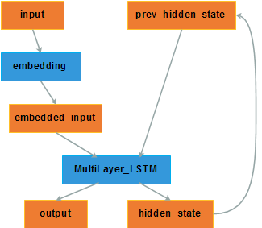
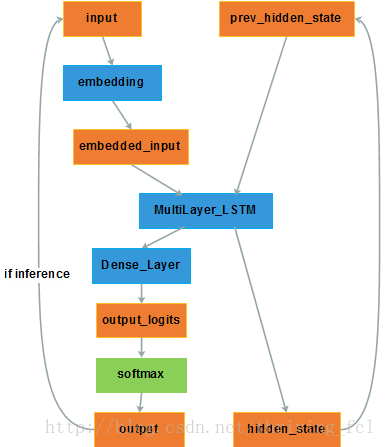
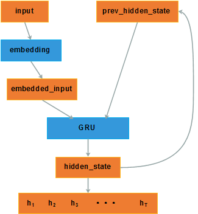
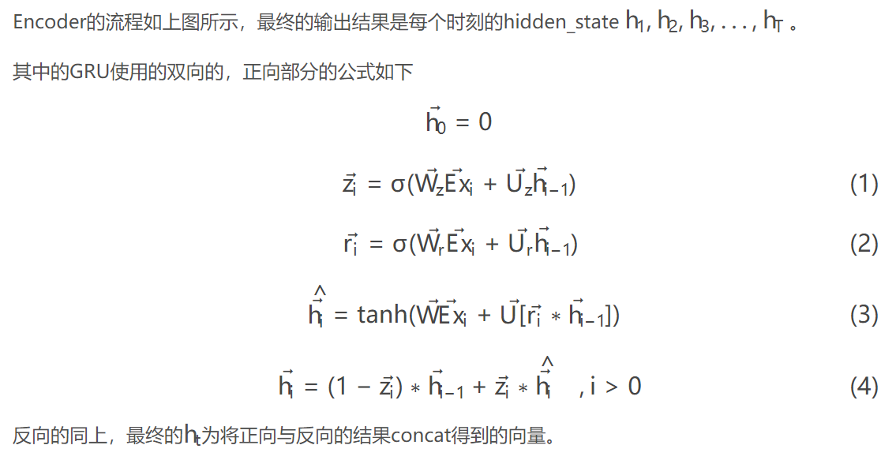
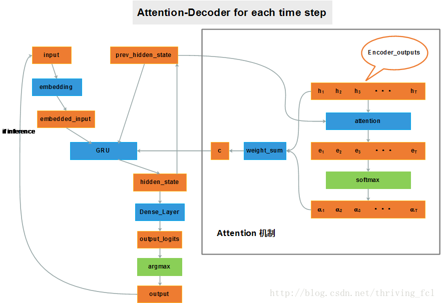
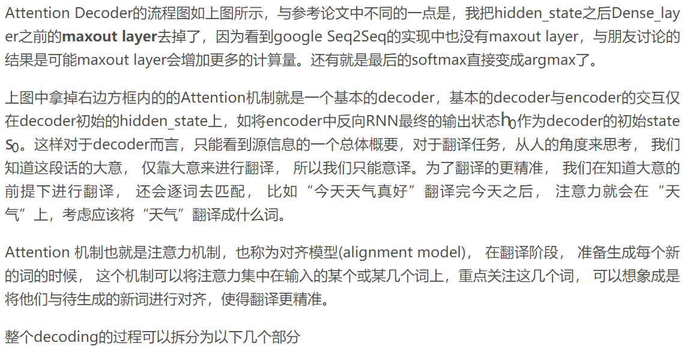

## seq2seq模型Python实现 

本节主要讲解如何用tensorflow及keras实现seq2seq2模型，我们后期的联信文本聊天机器人的主要训练模型就采用seq2seq

---

### 1.tensorflow实现seq2seq

Tensorflow 1.0.0 版本以后，开发了新的seq2seq接口，弃用了原来的接口。旧的seq2seq接口是tf.contrib.legacy_seq2seq下，新的接口在tf.contrib.seq2seq下。

新seq2seq接口与旧的相比最主要的区别是它是动态展开的，而旧的是静态展开的。

+ 静态展开(static unrolling) ：指的是定义模型创建graph的时候，序列的长度是固定的，之后传入的所有序列都得是定义时指定的长度。这样所有的句子都要padding到指定的长度，很浪费存储空间，计算效率也不高
+ 动态展开(dynamic unrolling)：使用控制流ops处理序列，可以不需要事先指定好序列长度
+ 不管静态还是动态，输入的每一个batch内的序列长度都要一样

```python
in[4]: tf.__version__
Out[4]: '1.5.0'

```

```python

_allowed_symbols = [
    "sequence_loss",
    "Decoder",
    "dynamic_decode",
    "BasicDecoder",
    "BasicDecoderOutput",
    "BeamSearchDecoder",
    "BeamSearchDecoderOutput",
    "BeamSearchDecoderState",
    "Helper",
    "CustomHelper",
    "FinalBeamSearchDecoderOutput",
    "gather_tree",
    "GreedyEmbeddingHelper",
    "SampleEmbeddingHelper",
    "ScheduledEmbeddingTrainingHelper",
    "ScheduledOutputTrainingHelper",
    "TrainingHelper",
    "BahdanauAttention",
    "LuongAttention",
    "hardmax",
    "AttentionWrapperState",
    "AttentionWrapper",
    "AttentionMechanism",
    "tile_batch"]


```

熟悉这些接口最好的方法就是阅读API文档，然后使用它们。


#### 1.1 经典的seq2seq模型

<div align=center>

</div>

**图6:论文[2] 模型结构**

输入的序列为['A', 'B', 'C', '<EOS>']，输出序列为['W', 'X', 'Y', 'Z', '<EOS>']

这里Encoder对输入序列进行编码，将最后一时刻输出的hidden state(下文的final state)作为输入序列的编码向量。
Decoder将终止符<EOS>作为初始输入(也可以使用其他符号如<SOS>等)，Encoder的final state作为初始状态，然后生成序列直到遇上终止符<EOS>。

结构很简单，只要实现Encoder与Decoder再将他们串起来即可。

论文[2]中的Encoder使用的是一个4层的单向LSTM，这一部分使用RNN的接口即可，还不需要用到Seq2Seq中的接口。第一张图中的模型框架虽然阐述清楚了Encoder-Decoder这种架构，但是具体实现上，不是直接将序列['A', 'B', 'C', '<EOS>']输入到Encoder中，Encoder的完整架构如下图所示：


**---------------------Encoder----------------**

<div align=center>

</div>

**图8:Encoder结构**

+ **input**：不是原始的序列，而是将序列中的每个元素都转换为字典中对应的id。不管是train还是inference阶段，为了效率都是一次输入一个mini-batch，所以需要为input定义一个int型rank=2的placeholder。

+ **embedding**：定义为trainable=True的变量，这样即使使用pre-trained的词向量也可以在训练模型的过程中调优。

+ **MultiLayer_LSTM**：接收的输入是序列中每个元素对应的词向量。

其中，tf.nn.dynamic_rnn方法接收encoder实例以及embbeded向量之后，就会输出包含每个时刻hidden state的outputs以及final state，如果初始状态为0的话，不需要显式的声明zero_state再将其作为参数传入，只需要指定state的dtype，这个方法中会将初始状态自动初始化为0向量

**------------------Decoder----------------------**

<div align=center>

</div>

**图9:Encoder结构**


+ **input**：与encoder的一样，也是序列元素对应的id。

+ **embedding**：视情况而定需不需要与encoder的embedding不同，比如在翻译中，源语言与目标语言的词向量空间就不一样，但是像文本摘要这种都是基于一种语言的，encoder与decoder的embedding matrix是可以共用的。

+ **Dense_Layer**：与encoder仅输出hidden state不同，decoder需要输出每个时刻词典中各token的概率，因此还需要一个dense layer将hidden state向量转换为维度等于vocabulary_size的向量，然后再将dense layer输出的logits经过softmax层得到最终的token概率。

+ **Decoder**的定义需要区分inference阶段还是train阶段。

+ inference阶段，decoder的输出是未知的，对于生成['W', 'X', 'Y', 'Z', '<EOS>']序列，是在decoder输出token 'W'之后，再将'W'作为输入，结合此时的hidden state，推断出下一个token 'X'，以此类推直到输出为<EOS>或达到最长序列长度之后终止。

+ 而在train阶段，decoder应该输出的序列是已知的，不管最终output的结果是什么，都将已知序列中的token依次输入。train的阶段如果也将输出的结果再作为输入，一旦前面的一步错了，都会放大误差，导致训练过程更不稳定。

+ decoder将用到seq2seq中的TrainingHelper, GreedyEmbeddingHelper, BasicDecoder三个类，以及dynamic_decode方法，还将用到tensorflow.python.layers.core下的Dense类。


1.BasicDecoder

实现decoder最先关注到的就是BasicDecoder，它的构造函数与参数的定义如下：

```python

__init__( cell, helper, initial_state, output_layer=None ) 
- cell: An RNNCell instance. 
- helper: A Helper instance. 
- initial_state: A (possibly nested tuple of…) tensors and TensorArrays. The initial state of the RNNCell. 
- output_layer: (Optional) An instance of tf.layers.Layer, i.e., tf.layers.Dense. Optional layer to apply to the RNN output prior to storing the result or sampling.
```


+ **cell**：在这里就是一个多层LSTM的实例，与定义encoder时无异 

+ **helper**：这里只是简单说明是一个Helper实例，第一次看文档的时候肯定还不知道这个Helper是什么，不用着急，看到具体的Helper实例就明白了 

+ **initial_state**：encoder的final state，类型要一致，也就是说如果encoder的final state是tuple类型(如LSTM的包含了cell state与hidden state)，那么这里的输入也必须是tuple。直接将encoder的final_state作为这个参数输入即可 

+ **output_layer**：对应的就是框架图中的Dense_Layer，只不过文档里写tf.layers.Dense，但是tf.layers下只有dense方法，Dense的实例还需要from tensorflow.python.layers.core import Dense。

BasicDecoder的作用就是定义一个封装了decoder应该有的功能的实例，根据Helper实例的不同，这个decoder可以实现不同的功能，比如在train的阶段，不把输出重新作为输入，而在inference阶段，将输出接到输入。


2.TrainingHelper

构造函数与参数如下：

```python
__init__( inputs, sequence_length, time_major=False, name=None ) 
- inputs: A (structure of) input tensors. 
- sequence_length: An int32 vector tensor. 
- time_major: Python bool. Whether the tensors in inputs are time major. If False (default), they are assumed to be batch major. 
- name: Name scope for any created operations.
```

+ **inputs**：对应Decoder框架图中的embedded_input，time_major=False的时候，inputs的shape就是[batch_size, sequence_length, embedding_size] ，time_major=True时，inputs的shape为[sequence_length, batch_size, embedding_size] 

+ **sequence_length**：这个文档写的太简略了，不过在源码中可以看出指的是当前batch中每个序列的长度(self._batch_size = array_ops.size(sequence_length))。 

+ **time_major**：决定inputs Tensor前两个dim表示的含义 
name：如文档所述

TrainingHelper用于train阶段，next_inputs方法一样也接收outputs与sample_ids，但是只是从初始化时的inputs返回下一时刻的输入。

3.GreedyEmbeddingHelper

```python
__init__( embedding, start_tokens, end_token ) 
- embedding: A callable that takes a vector tensor of ids (argmax ids), or the params argument for embedding_lookup. The returned tensor will be passed to the decoder input. 
- start_tokens: int32 vector shaped [batch_size], the start tokens. 
- end_token: int32 scalar, the token that marks end of decoding.

A helper for use during inference. 
Uses the argmax of the output (treated as logits) and passes the result through an embedding layer to get the next input.

```

官方文档已经说明，这是用于inference阶段的helper，将output输出后的logits使用argmax获得id再经过embedding layer来获取下一时刻的输入。

+ **embedding**：params argument for embedding_lookup，也就是 定义的embedding 变量传入即可。 
+ **start_tokens**： batch中每个序列起始输入的token_id 
+ **end_token**：序列终止的token_id


4.dynamic_decode

```python
dynamic_decode( decoder, output_time_major=False, impute_finished=False, maximum_iterations=None, parallel_iterations=32, swap_memory=False, scope=None)
```

这个方法很直观，将定义好的decoder实例传入，其他几个参数文档介绍的很清楚。很值得学习的是其中如何使用control flow ops来实现dynamic的过程。

**------------------代码--------------------**

综合使用上述接口实现基本Encoder-Decoder模型的代码如下

```python
import tensorflow as tf
from tensorflow.contrib.seq2seq import *
from tensorflow.python.layers.core import Dense


class Seq2SeqModel(object):

    def __init__(self, rnn_size, layer_size, encoder_vocab_size, 
        decoder_vocab_size, embedding_dim, grad_clip, is_inference=False):
        # define inputs
        self.input_x = tf.placeholder(tf.int32, shape=[None, None], name='input_ids')

        # define embedding layer
        with tf.variable_scope('embedding'):
            encoder_embedding = tf.Variable(tf.truncated_normal(shape=[encoder_vocab_size, embedding_dim], stddev=0.1), 
                name='encoder_embedding')
            decoder_embedding = tf.Variable(tf.truncated_normal(shape=[decoder_vocab_size, embedding_dim], stddev=0.1),
                name='decoder_embedding')

        # define encoder
        with tf.variable_scope('encoder'):
            encoder = self._get_simple_lstm(rnn_size, layer_size)

        with tf.device('/cpu:0'):
            input_x_embedded = tf.nn.embedding_lookup(encoder_embedding, self.input_x)

        encoder_outputs, encoder_state = tf.nn.dynamic_rnn(encoder, input_x_embedded, dtype=tf.float32)

        # define helper for decoder
        if is_inference:
            self.start_tokens = tf.placeholder(tf.int32, shape=[None], name='start_tokens')
            self.end_token = tf.placeholder(tf.int32, name='end_token')
            helper = GreedyEmbeddingHelper(decoder_embedding, self.start_tokens, self.end_token)
        else:
            self.target_ids = tf.placeholder(tf.int32, shape=[None, None], name='target_ids')
            self.decoder_seq_length = tf.placeholder(tf.int32, shape=[None], name='batch_seq_length')
            with tf.device('/cpu:0'):
                target_embeddeds = tf.nn.embedding_lookup(decoder_embedding, self.target_ids)
            helper = TrainingHelper(target_embeddeds, self.decoder_seq_length)

        with tf.variable_scope('decoder'):
            fc_layer = Dense(decoder_vocab_size)
            decoder_cell = self._get_simple_lstm(rnn_size, layer_size)
            decoder = BasicDecoder(decoder_cell, helper, encoder_state, fc_layer)

        logits, final_state, final_sequence_lengths = dynamic_decode(decoder)

        if not is_inference:
            targets = tf.reshape(self.target_ids, [-1])
            logits_flat = tf.reshape(logits.rnn_output, [-1, decoder_vocab_size])
            print ('shape logits_flat:{}'.format(logits_flat.shape))
            print ('shape logits:{}'.format(logits.rnn_output.shape))

            self.cost = tf.losses.sparse_softmax_cross_entropy(targets, logits_flat)

            # define train op
            tvars = tf.trainable_variables()
            grads, _ = tf.clip_by_global_norm(tf.gradients(self.cost, tvars), grad_clip)

            optimizer = tf.train.AdamOptimizer(1e-3)
            self.train_op = optimizer.apply_gradients(zip(grads, tvars))
        else:
            self.prob = tf.nn.softmax(logits)

    def _get_simple_lstm(self, rnn_size, layer_size):
        lstm_layers = [tf.contrib.rnn.LSTMCell(rnn_size) for _ in xrange(layer_size)]
        return tf.contrib.rnn.MultiRNNCell(lstm_layers)


```


**---------------实例----------------**

```python

随机序列生成器
def random_sequences(length_from, length_to, vocab_lower, vocab_upper, batch_size):
    def random_length():
        if length_from == length_to:
            return length_from
        return np.random.randint(length_from, length_to + 1)

    while True:
        yield [
            np.random.randint(low=vocab_lower, high=vocab_upper, size=random_length()).tolist()
            for _ in range(batch_size)
            ]
```

构建一个随机序列生成器方便后面生成序列，其中 length_from 和 length_to表示序列的长度范围从多少到多少，vocab_lower 和 vocab_upper 表示生成的序列值的范围从多少到多少，batch_size 即是批的数量。

```python


填充序列
def make_batch(inputs, max_sequence_length=None):
    sequence_lengths = [len(seq) for seq in inputs]
    batch_size = len(inputs)
    if max_sequence_length is None:
        max_sequence_length = max(sequence_lengths)
    inputs_batch_major = np.zeros(shape=[batch_size, max_sequence_length], dtype=np.int32)
    for i, seq in enumerate(inputs):
        for j, element in enumerate(seq):
            inputs_batch_major[i, j] = element
    inputs_time_major = inputs_batch_major.swapaxes(0, 1)
    return inputs_time_major, sequence_lengths

```

生成的随机序列的长度是不一样的，需要对短的序列用来填充，而可设为0，取最长的序列作为每个序列的长度，不足的填充，然后再转换成time major形式。

```python
构建图
encoder_inputs = tf.placeholder(shape=(None, None), dtype=tf.int32, name='encoder_inputs')
ecoder_inputs = tf.placeholder(shape=(None, None), dtype=tf.int32, name='decoder_inputs')
decoder_targets = tf.placeholder(shape=(None, None), dtype=tf.int32, name='decoder_targets')
```

创建三个占位符，分别为encoder的输入占位符、decoder的输入占位符和decoder的target占位符。

```python
embeddings = tf.Variable(tf.random_uniform([vocab_size, input_embedding_size], -1.0, 1.0), dtype=tf.float32)
encoder_inputs_embedded = tf.nn.embedding_lookup(embeddings, encoder_inputs)
decoder_inputs_embedded = tf.nn.embedding_lookup(embeddings, decoder_inputs)
```

将encoder和decoder的输入做一个嵌入操作，对于大词汇量这个能达到降维的效果，嵌入操作也是很常用的方式了。在seq2seq模型中，encoder和decoder都是共用一个嵌入层即可。嵌入层的向量形状为[vocab_size, input_embedding_size]，初始值从-1到1，后面训练会自动调整。

```python
encoder_cell = tf.contrib.rnn.LSTMCell(encoder_hidden_units)
encoder_outputs, encoder_final_state = tf.nn.dynamic_rnn(
        encoder_cell, encoder_inputs_embedded,
        dtype=tf.float32, time_major=True,
    )
decoder_cell = tf.contrib.rnn.LSTMCell(decoder_hidden_units)
decoder_outputs, decoder_final_state = tf.nn.dynamic_rnn(
        decoder_cell, decoder_inputs_embedded,
        initial_state=encoder_final_state,
        dtype=tf.float32, time_major=True, scope="plain_decoder",
    )

```

创建encoder和decoder的LSTM神经网络，encoder_hidden_units 为LSTM隐层数量，设定输入格式为time major格式。这里我们不关心encoder的循环神经网络的输出，我们要的是它的最终状态encoder_final_state，将其作为decoder的循环神经网络的初始状态。


```python
decoder_logits = tf.contrib.layers.linear(decoder_outputs, vocab_size)
decoder_prediction = tf.argmax(decoder_logits, 2)
stepwise_cross_entropy = tf.nn.softmax_cross_entropy_with_logits(
        labels=tf.one_hot(decoder_targets, depth=vocab_size, dtype=tf.float32),
        logits=decoder_logits,
    )
loss = tf.reduce_mean(stepwise_cross_entropy)
train_op = tf.train.AdamOptimizer().minimize(loss)
```

对于decoder的循环神经网络的输出，因为我们要一个分类结果，所以需要一个全连接神经网络，输出层神经元数量是词汇的数量。输出层最大值对应的神经元即为预测的类别。输出层的激活函数用softmax，损失函数用交叉熵损失函数。

```python
创建会话
with tf.Session(graph=train_graph) as sess:
    sess.run(tf.global_variables_initializer())
    for epoch in range(epochs):
        batch = next(batches)
        encoder_inputs_, _ = make_batch(batch)
        decoder_targets_, _ = make_batch([(sequence) + [EOS] for sequence in batch])
        decoder_inputs_, _ = make_batch([[EOS] + (sequence) for sequence in batch])
        feed_dict = {encoder_inputs: encoder_inputs_, decoder_inputs: decoder_inputs_,
                     decoder_targets: decoder_targets_,
                     }
        _, l = sess.run([train_op, loss], feed_dict)
        loss_track.append(l)
        if epoch == 0 or epoch % 1000 == 0:
            print('loss: {}'.format(sess.run(loss, feed_dict)))
            predict_ = sess.run(decoder_prediction, feed_dict)
            for i, (inp, pred) in enumerate(zip(feed_dict[encoder_inputs].T, predict_.T)):
                print('input > {}'.format(inp))
                print('predicted > {}'.format(pred))
                if i >= 20:
                    break

```
创建会话开始执行，每次生成一批数量，用 make_batch 分别创建encoder输入、decoder的target和decoder的输入。其中target需要在后面加上[EOS]，它表示句子的结尾，同时输入也加上[EOS]表示编码开始。每训练1000词输出看看效果。


#### 1.2 Attention Seq2Seq模型

下面我们梳理一下带Attention的seq2seq的结构


**-------------Bi-RNN Encoder-----------------------**

<div align=center>

</div>


<div align=center>

</div>


**----------------Attention-Decoder------------------**

<div align=center>

</div>

<div align=center>

</div>

详细的分析可以参见参考文献【8】。


#### 1.3 tf-seq2seq开源框架

2017年4月11日，Google的大脑研究团队发布了 tf-seq2seq这个开源的TensorFlow框架，它能够轻易进行实验而达到现有的效果，团队制作了该框架的代码库和模块等，能够最好地支持其功能。去年，该团队发布了Google神经机器翻译（GoogleNeural Machine Translation，GNMT），它是一个序列到序列sequence-to-sequence（“seq2seq”）的模型，目前用于Google翻译系统中。虽然GNMT在翻译质量上有长足的进步，但是它还是受限于训练的框架无法对外部研究人员开放的短板。


### 2.keras实现seq2seq

在官方的keras实例中有完整的seq2seq,可以参考参考文献【9】。


### 3.参考文献

[1] <https://google.github.io/seq2seq/>

[2] <https://github.com/DataXujing/seq2seq>

[3] <https://www.w3cschool.cn/tensorflow_python/tensorflow_python-i8jh28vt.html>

[4] <http://www.tensorfly.cn/>

[5] <http://blog.csdn.net/thriving_fcl/article/details/74165062>

[6] <http://blog.csdn.net/wangyangzhizhou/article/details/77977655>

[7] <https://www.bilibili.com/video/av12005043/>

[8] <http://blog.csdn.net/thriving_fcl/article/details/74853556>

[9] <https://github.com/keras-team/keras/blob/master/examples/lstm_seq2seq.py>