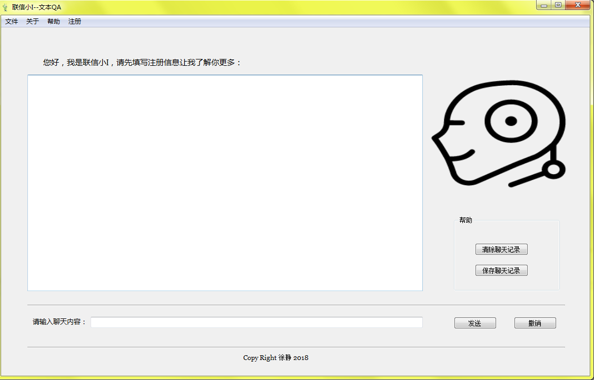

## 实现文本QA软件

---

+ 花了一天时间，做了个聊天机器人
+ 本来打算用seq2seq作为model去训练（训练时间还挺长GPU or TPU not CPU，网上没有训练好保存下来的模型）
+ 时间比较紧张，为了快速实现调用了图灵机器人的API(云服务)<http://www.tuling123.com/>
+ 给我点时间，让我的seq2seq训练出来，直接上阵

该聊天工具的压缩包已上传

链接：<https://pan.baidu.com/s/1hupgqP2> 密码：152u

---

---

